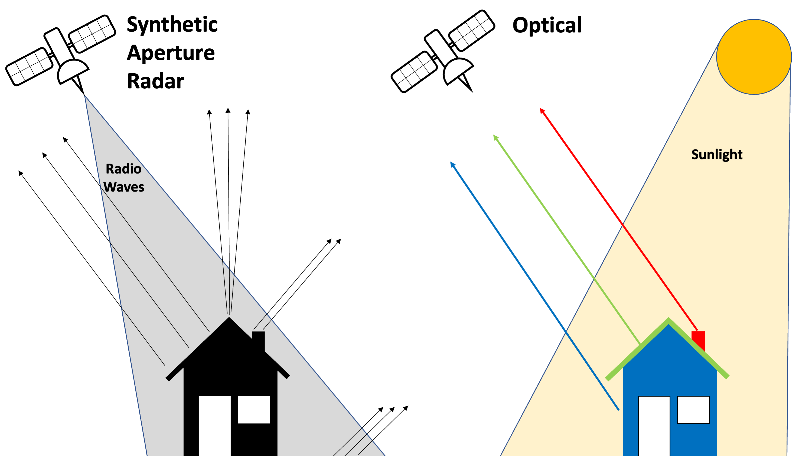

*Many military radars interfere with open source satellite imagery when they're turned on. A new [tool](https://ollielballinger.users.earthengine.app/view/bellingcat-radar-interference-tracker) lets anyone monitor when and where these radars are deployed. This repository contains the source code for this tool.* 

# A Tour of the Bellingcat Radar Interference Tracker

Below is a screenshot of the tool in use with five labeled components, each of which we will look at individually. In this example, the tool is centered on a MIM-104 Patriot PAC-2 missile defense system stationed in Dammam, Saudi Arabia. The imagery displayed is an aggregate images taken in January, 2022. 

1. The dot at the center of the screen indicates the location at which Radio Frequency Interference (RFI) is being measured. Users can measure RFI at any location by simply clicking on the map at the point they wish to investigate.

2. The graph on the left shows historical Radio Frequency Interference (RFI) at the location of the blue point in the center of the map. The red and blue stripes on the map correspond to the large spikes in this graph, which generally indicate the presence of a military radar or another source of C-band interference. In this example, we can see that this radar was turned on at some point in mid-2021. Hovering  over the graph will display the date that the imagery was captured, and clicking on the graph will load imagery from that period. Users can download the graph by clicking on the  button

3. This line indicates the date and level of aggregation (year, month, day) of the imagery being displayed.

4. The dropdown menu allows users to aggregate satellite imagery at three levels; Aggregating by year is time consuming, but useful for dragnet monitoring. If a radar is detected at any point in a given year, it will be visible in this layer. Aggregating by month or day is much quicker, and useful if you’ve already found a radar and want to investigate it further. The opacity of the radar layer can be toggled with the slider on the right. 

5. To visit the locations of known radars, select one of the locations from this dropdown menu. 

# How it works

While most satellite imagery is optical, meaning it captures sunlight reflected by the earth’s surface, Synthetic Aperture Radar (SAR) satellites such as Sentinel-1 work by emitting pulses of C-band radio waves and measuring how much of the signal is reflected back. This is similar to the way a bat uses sonar to “see” in the dark: by emitting calls and listening to echoes.

Coincidentally, the radars on some missile defence batteries (such as the MIM-104 Patriot PAC-2) and other military radars operate using frequencies in the NATO G-band (4,000 to 6,000 Gigahertz) which overlaps with the civilian C-band (4,000, to 8,000 Gigahertz), commonly used by open source SAR satellites.  

In the simplest terms, this means that when the radar on the likes of a Patriot battery is turned on, Sentinel-1 picks up both the echo from its own pulse of radio waves, as well as a powerful blast of radio waves from the ground-based radar. This shows up as a stripe of interference perpendicular to the orbital pass of the satellites: 

Sentinel-1 works by illuminating a 250km long and 5km wide swath of land below the satellite with a pulse of C-band radio waves (shown as the red triangle). If interference is detected, its source (depicted as a yellow dot above) will be located somewhere within this swath. 

Other military radars that operate on the same C-band frequency include naval radars such as the Japanese FCS-3, the Chinese Type-381 and the Russian S-400 Surface to Air Missile system. All should be detectable when switched on and in view of Sentinel-1.

# How to find a military radar

in order to monitor a large area for the presence of ground-based radars in the past seven years, follow these steps:

1. Navigate to your area of interest by dragging the map and zooming in or out. 

2. Where it says “Display imagery aggregated by”, select “Year” from the dropdown menu. 

3. Click on a random date in each year to load data from that entire year
    - For example, clicking on June 10th, 2018 will load a composite image for all of 2018.
    - Repeat this for each year. 

4. If you spot interference, click on it to reveal the dates that the signal is detected. 

5. Zoom to the interference stripe and gradually decrease opacity to find the source of the interference using the high resolution satellite basemap. 

